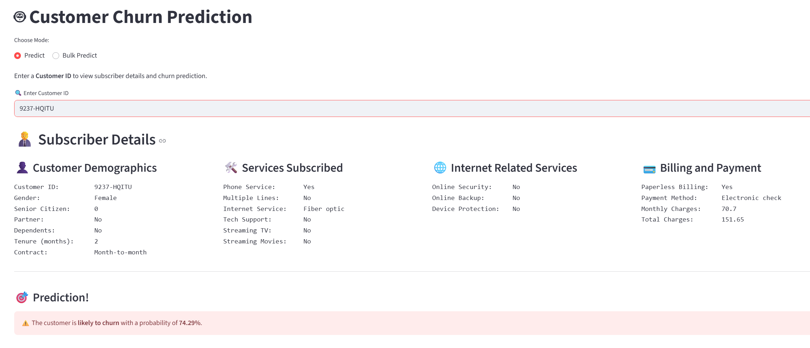

📊 End-to-End Customer Churn Prediction using MLflow, DVC & Streamlit
This project implements a complete Customer Churn Prediction Pipeline using:

🧱 Modular Python architecture

⚙️ DVC for pipeline stage tracking

📈 MLflow for experiment tracking

🧠 LightGBM model

🌐 Streamlit UI for end-user interaction

🚀 Project Pipeline Overview
This MLOps project follows a real-world structure for scalable, maintainable machine learning:
Raw Data → Ingestion → Validation → Preprocessing → Feature Engineering → Training → Evaluation → Streamlit UI

Each stage is modular and can be triggered independently or via:

dvc repro

### 🔧 Tech Stack

| Category             | Tools/Frameworks       |
|----------------------|------------------------|
| Language             | Python                 |
| Data Versioning      | DVC                    |
| Experiment Tracking  | MLflow                 |
| Model                | LightGBM               |
| UI                   | Streamlit              |
| Package Management   | pip, requirements.txt  |
| Environment          | venv                   |

⚙️ How to Run
1. Clone and Setup Environment
git clone https://github.com/<your-username>/churn-prediction-mlops-pipeline.git
cd churn-prediction-mlops-pipeline

# Create and activate virtual environment
python -m venv venv
.\venv\Scripts\activate     # (Windows)

# Install dependencies
pip install -r requirements.txt
# Run all DVC-tracked stages
dvc repro
mlflow ui
# Open http://127.0.0.1:5000 in your browser
streamlit run streamlit_ui/app.py

📈 Model
We use a LightGBM Classifier with hyperparameters tracked in params.yaml. The model is trained on engineered features to predict Churn_Label.

Artifacts stored:

model.joblib

scaler.joblib

columns.json

🖼️ Streamlit UI Preview

✅ **Single user prediction**  

✅ **Bulk prediction**  

📌 Project Highlights
✅ Modular stage-wise pipeline (OOP-based)

✅ Integrated MLflow for model tracking

✅ Real-time Streamlit UI for predictions

✅ Clean version control using DVC

✅ Easy reproducibility and collaboration

